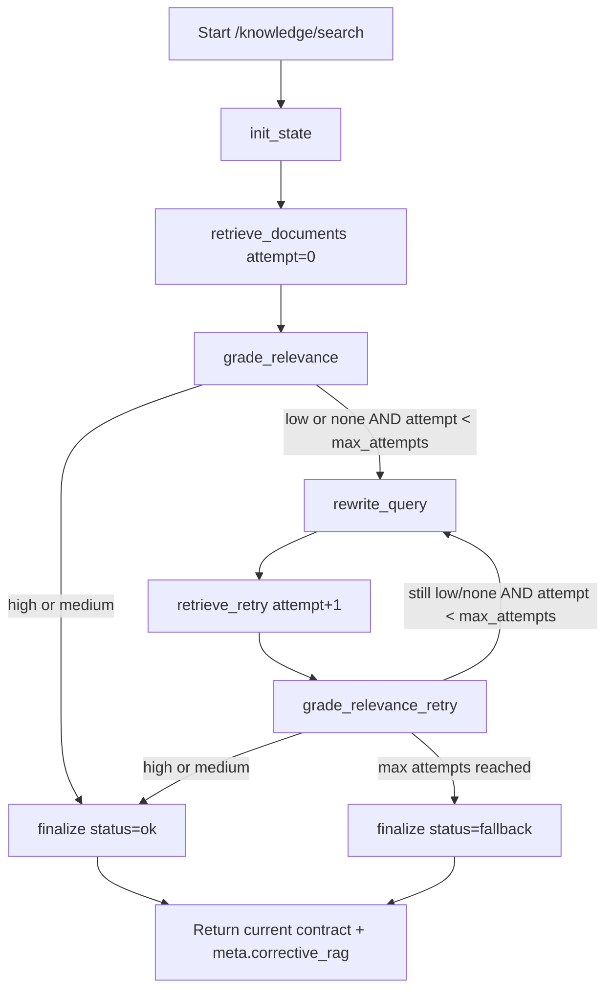

# Corrective RAG LangGraph Plan

Status: In progress (Phase 1 wired)  
Last updated: 2026-02-18

## Goal

Add a LangGraph-based corrective retrieval loop that improves weak retrieval queries while keeping the existing API contract stable for `POST /knowledge/search`.

Interview value:
- conditional edges,
- bounded retry loop,
- quality grading gate,
- fallback policy,
- observable telemetry.

## Integration Options

1. LangGraph in backend (Node/LangGraphJS)
- Where: `backend/src/routes/knowledgeSearchRoute.js` + new backend service module.
- Pros: no retrieval-service API changes.
- Cons: new JS LangGraph dependency in Node service.

2. LangGraph in retrieval-service (Python, recommended)
- Where: `retrieval-service/app/*` as new corrective workflow module.
- Pros: Python LangGraph is mature and close to retrieval internals.
- Cons: adds retrieval-service complexity.

3. Separate LangGraph sidecar service
- Where: new Python service called by backend.
- Pros: isolation.
- Cons: extra deployment surface.

Recommended for this repo: option 2.

## Proposed Runtime Path (Option 2)

1. Frontend continues to call `POST /knowledge/search` unchanged.
2. Backend route stays as proxy contract boundary.
3. Retrieval-service adds a LangGraph corrective path and keeps classic path as fallback.
4. Feature flag controls rollout:
- `RETRIEVAL_CORRECTIVE_RAG_ENABLED=1`

## State Schema

```python
from typing import Any, Dict, List, Literal, Optional, TypedDict

RelevanceLabel = Literal["high", "medium", "low", "none"]
WorkflowStatus = Literal["ok", "fallback", "failed"]

class CorrectiveRagState(TypedDict, total=False):
    request_id: str
    query_original: str
    query_en: str
    language: str
    top_k: int

    attempt: int
    max_attempts: int
    used_queries: List[str]

    retrieval_results: List[Dict[str, Any]]
    relevance_label: RelevanceLabel
    relevance_score: float
    relevance_reason: str

    rewritten_query_en: Optional[str]
    rewrite_reason: Optional[str]

    final_results: List[Dict[str, Any]]
    status: WorkflowStatus
    fallback_reason: Optional[str]

    timings_ms: Dict[str, float]
```

## Node Design

1. `init_state`
- Normalize request and initialize counters.

2. `retrieve_documents`
- Execute existing retrieval run (`RetrievalService.search` path).

3. `grade_relevance`
- Grade top results (`high/medium/low/none`) using:
- heuristic first (score coverage + lexical overlap),
- optional LLM grader flag later.

4. `route_after_grade` (conditional edge)
- if `high|medium`: finalize.
- if `low|none` and `attempt < max_attempts`: rewrite.
- otherwise: fallback finalize.

5. `rewrite_query`
- Rewrite to a more retrieval-friendly English query.
- Prefer deterministic/cheap rewrite first; optional LLM rewrite flag.

6. `retrieve_retry`
- Rerun retrieval with rewritten query.

7. `finalize`
- Return best results under existing contract:
- preserve `results`, `used_queries`, `index_name`.
- add optional metadata field:
- `meta.corrective_rag` with `attempts`, labels, and fallback reason.

## Process Graph

Mermaid source: `docs/corrective_rag_langgraph_flow.mmd`



## API Compatibility

Keep existing response shape required by frontend:
- `results`
- `used_queries`
- `index_name`

Optional additive fields only:
- `meta.corrective_rag.attempts`
- `meta.corrective_rag.relevance_labels`
- `meta.corrective_rag.fallback_reason`

No breaking changes to `shader-playground/src/realtime/knowledgeSearchService.js` are required.

## Rollout Plan

1. Phase 1: Wiring + no behavior change
- Add corrective module behind flag.
- If disabled, current retrieval path runs exactly as-is.

Phase 1 status (2026-02-18):
- implemented in `retrieval-service/app/corrective_rag_graph.py`,
- backend/retrieval request contracts updated for optional `dialogue_context`,
- frontend tool-call path can auto-fill `dialogue_context` from recent stored
  utterances when omitted by the model,
- additive `meta.corrective_rag` response metadata added.

2. Phase 2: Heuristic grader + one rewrite retry
- `max_attempts=1` initial cap.

3. Phase 3: Telemetry + tests
- add node-level tests and integration tests for weak-query correction loop.

4. Phase 4: Optional LLM grader/rewrite
- controlled by separate flags to contain cost/latency.

## Concrete File Plan

Retrieval service:
- `retrieval-service/app/corrective_rag_graph.py` (LangGraph workflow)
- `retrieval-service/app/relevance_grader.py` (heuristic grader helpers)
- `retrieval-service/app/query_rewriter.py` (rewrite strategy)
- `retrieval-service/app/main.py` (route integration)
- `retrieval-service/app/models.py` (optional additive metadata model)

Backend:
- `backend/src/routes/knowledgeSearchRoute.js` (no contract change; proxy pass-through)

Tests:
- `retrieval-service/tests/test_corrective_rag_graph.py`
- `retrieval-service/tests/test_relevance_grader.py`
- `backend/tests/modules/extracted-modules.test.mjs` (assert pass-through of additive meta)

## Interview Talking Points

1. Why a graph instead of a single chain:
- explicit quality gate and conditional retry logic.
2. Safety:
- bounded retries, fallback path, feature flags.
3. Backward compatibility:
- no contract break for existing frontend consumers.
4. Observability:
- per-node timings and relevance labels exposed in metadata.
