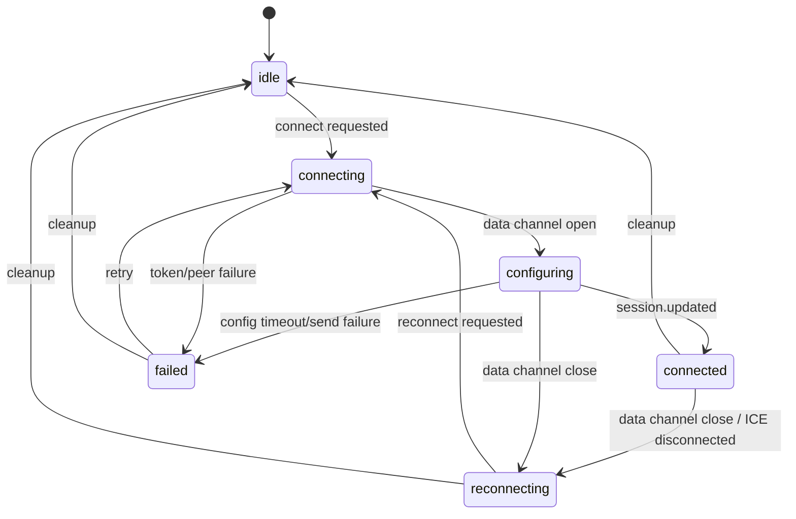

# Realtime API GA Migration Plan

Status: Planned  
Last updated: 2026-05-08  
Target model: `gpt-realtime-1.5`  
Default voice: `marin`

## Goal

Migrate the app's OpenAI Realtime WebRTC voice path from the retired beta
preview contract to the GA Realtime API contract while preserving the current
frontend/backend ownership boundaries.

The migration fixes broken voice features caused by the shutdown of:
- `gpt-4o-realtime-preview-2024-12-17`
- `gpt-4o-mini-realtime-preview-2024-12-17`

Primary user-facing success criteria:
- PTT connects successfully through WebRTC.
- The first user turn cannot start until the session is fully configured.
- The tutor prompt, tools, transcription, and audio settings are active before
  PTT is enabled.
- Assistant transcript streaming/finalization, interruptions, and function
  calls continue to work.

## Immediate Security Action

An OpenAI API key has been exposed in local IDE context and conversation text.
Rotate that key before any manual smoke test or deployment. Treat the current
key as compromised.

Do not commit `.env`.

## Official Docs

Use official OpenAI docs as the source of truth during implementation:
- Realtime WebRTC guide:
  `https://developers.openai.com/api/docs/guides/realtime-webrtc`
- Realtime conversations guide:
  `https://developers.openai.com/api/docs/guides/realtime-conversations`
- Realtime client secrets reference:
  `https://developers.openai.com/api/reference/resources/realtime/subresources/client_secrets`
- Realtime model docs:
  `https://developers.openai.com/api/docs/models/gpt-realtime-1.5`

## Key Decision

Keep the existing ephemeral-token browser WebRTC architecture.

OpenAI documents two viable WebRTC patterns:
- browser requests an ephemeral client secret from the app backend, then posts
  SDP directly to OpenAI,
- app backend handles the unified `/v1/realtime/calls` request.

This repo already uses the first pattern. Keeping it avoids moving SDP exchange
into the backend and limits the migration to the existing token, transport,
session config, lifecycle, and event-routing modules.

## Non-Goals

- Do not redesign the Realtime architecture around backend-owned SDP exchange.
- Do not change the retrieval, correction, or profile tool contracts except for
  GA-compatible session tool registration.
- Do not change the UI design beyond accurate connection/readiness status.
- Do not add a placeholder `OpenAI-Safety-Identifier`; only add it once a real,
  stable, privacy-safe user identifier is available.

## Contract Changes

### Backend Token Request

Current beta endpoint:

```text
POST https://api.openai.com/v1/realtime/sessions
```

GA endpoint:

```text
POST https://api.openai.com/v1/realtime/client_secrets
```

Current beta request body:

```json
{
  "model": "gpt-4o-realtime-preview-2024-12-17",
  "voice": "verse"
}
```

GA request body:

```json
{
  "session": {
    "type": "realtime",
    "model": "gpt-realtime-1.5",
    "audio": {
      "output": {
        "voice": "marin"
      }
    }
  }
}
```

The backend should make both model and voice configurable:

```env
REALTIME_MODEL=gpt-realtime-1.5
REALTIME_VOICE=marin
```

### Backend Token Response

GA returns top-level `value`, `expires_at`, and `session` fields. The backend
should preserve that response and add the legacy compatibility alias expected by
current frontend code.

```js
const ephemeralKey = data.value || data.client_secret?.value;

return res.json({
  ...data,
  client_secret: {
    value: ephemeralKey,
    expires_at: data.expires_at
  },
  tokenUsage: usage
});
```

This lets the frontend support both shapes during rollout:

```js
const ephemeralKey = data.value || data.client_secret?.value;
```

### WebRTC SDP Exchange

Current beta URL:

```text
POST https://api.openai.com/v1/realtime?model=...
```

GA URL:

```text
POST https://api.openai.com/v1/realtime/calls
```

The model must not be encoded in the frontend SDP URL. It is bound to the
ephemeral client secret created by the backend.

Keep:
- `Authorization: Bearer <ephemeralKey>`
- `Content-Type: application/sdp`

Add a bounded ICE-gathering wait as transport hardening, but do not make ICE
completion a hard requirement. If gathering does not complete within the timeout,
continue with the current SDP behavior.

## Lifecycle Design

The most important migration risk is exposing the app as "connected" before the
GA session has accepted tools, transcription settings, audio settings, and the
tutor instructions.

Use this state model:

```text
idle -> connecting -> configuring -> connected
```

Keep `connected` meaning "ready for PTT". Do not introduce a second
"connected-but-not-ready" state.

State meanings:
- `idle`: no active connection.
- `connecting`: token request, WebRTC peer setup, data channel setup.
- `configuring`: data channel is open and `session.update` has been sent, but
  `session.updated` has not arrived yet.
- `connected`: session has emitted `session.updated`; PTT may start turns.
- `reconnecting`: transport became unavailable after being connected or
  configured.
- `failed`: connection or configuration failed.

Required behavior:
- `connect()` resolves only after `session.updated`.
- `connect()` rejects if prompt load, session update send, or configuration
  acknowledgement fails.
- PTT press while `connecting` or `configuring` returns a blocked result and does
  not call `connect()` again.
- PTT ready styling is applied only when state becomes `connected`.
- Timeout for `session.updated`: 10 seconds.
- The timeout is one-shot and must be cleared on success, close, reconnect,
  failure, and cleanup.

Recommended state graph:



## Prompt And Session Configuration

Move the YAML tutor prompt into `session.instructions` instead of sending it as a
separate `conversation.item.create` system message.

Reason:
- a single `session.updated` event confirms tools, transcription, audio config,
  and tutor instructions are active;
- first-turn readiness becomes easier to test and reason about;
- this matches the GA session-level configuration model.

GA session update shape:

```js
{
  type: 'session.update',
  session: {
    type: 'realtime',
    instructions,
    audio: {
      input: {
        transcription: { model: 'gpt-4o-mini-transcribe' },
        turn_detection: enableSemanticVad ? { ...SESSION_SEMANTIC_VAD_CONFIG } : null
      }
    },
    tools: cloneTools()
  }
}
```

Implementation notes:
- repurpose `systemPromptService.js` from `sendSystemPrompt()` to
  `loadPromptText()`;
- `loadPromptText()` should return the trimmed prompt string or throw;
- `sendSessionConfiguration()` should load the prompt, build `session.update`,
  send it, and throw on failure;
- remove the separate system-message send from connection open handling.

## Implementation Plan

### Phase 1: Backend Client Secret Contract

Files:
- `backend/src/routes/tokenRoute.js`
- `backend/server.js`
- `.env.example`
- `.env.production.example`
- `README.md`
- `docs/railway_runbook.md`

Tasks:
- replace `DEFAULT_REALTIME_SESSION_URL` with
  `DEFAULT_REALTIME_CLIENT_SECRETS_URL`;
- set default model to `gpt-realtime-1.5`;
- set default voice to `marin`;
- read `REALTIME_MODEL` and `REALTIME_VOICE` in `backend/server.js`;
- send GA `session` request body;
- parse both GA and legacy token response shapes;
- preserve full GA response and add `client_secret` compatibility alias;
- keep token usage initialization keyed by the actual ephemeral key.

Tests:
- GA response shape succeeds;
- legacy response shape still succeeds;
- missing token value returns a 500;
- request body contains `session.type`, model, and `audio.output.voice`.

### Phase 2: Frontend Transport

Files:
- `shader-playground/src/realtime/webrtcTransportService.js`
- `shader-playground/src/realtime/connectionBootstrapService.js`

Tasks:
- change SDP URL to `/v1/realtime/calls`;
- remove frontend model constant and query param;
- parse `data.value || data.client_secret?.value`;
- add timeout-bounded ICE gathering helper.

Tests:
- SDP request goes to `/v1/realtime/calls`;
- request has no `?model=`;
- GA token response parses;
- legacy token response parses;
- missing token fails clearly;
- ICE complete path waits and proceeds;
- ICE timeout path proceeds.

### Phase 3: Prompt Loader And GA Session Config

Files:
- `shader-playground/src/realtime/systemPromptService.js`
- `shader-playground/src/realtime/sessionConfigurationBuilder.js`
- `shader-playground/src/realtime/session.js`

Tasks:
- convert `sendSystemPrompt()` into `loadPromptText()`;
- include prompt text as `session.instructions`;
- update config nesting to `session.audio.input.*`;
- include `session.type = 'realtime'`;
- make prompt load and data channel send failures throw.

Tests:
- prompt loader returns trimmed YAML `prompt`;
- prompt loader throws on fetch failure;
- prompt loader throws on missing/empty prompt;
- session update includes `instructions`;
- session update uses GA audio nesting;
- semantic VAD remains behind the existing flag.

### Phase 4: Connection Readiness State

Files:
- `shader-playground/src/realtime/sessionConnectionState.js`
- `shader-playground/src/realtime/connectionLifecycleService.js`
- `shader-playground/src/realtime/dataChannelEventRouter.js`
- `shader-playground/src/realtime/session.js`
- `shader-playground/src/realtime/pttOrchestrator.js`
- `shader-playground/src/openaiRealtime.js`

Tasks:
- add `CONFIGURING`;
- keep `CONNECTED` as the only PTT-ready state;
- make `connect()` resolve after `session.updated`;
- make `dataChannel.onopen` send session config and start config timeout;
- add idempotent `onSessionConfigured` callback from event router;
- clear config timeout on success, close, reconnect, failed, cleanup;
- block PTT while connecting/configuring without starting another connect;
- update button status to reflect `Configuring...` if the UI is visible.

Tests:
- state machine covers `connecting -> configuring -> connected`;
- `connect()` does not resolve before `session.updated`;
- config timeout transitions to `failed`;
- data channel close during configuring transitions to `reconnecting`;
- PTT press while configuring does not call `connect()` again;
- PTT ready status is applied only after `session.updated`;
- `isConnectedToOpenAI()` returns true only for PTT-ready state.

### Phase 5: GA Event Names

Files:
- `shader-playground/src/realtime/dataChannelEventRouter.js`
- `shader-playground/src/realtime/realtimeEventCoordinator.js`
- related unit and integration tests

Replace:
- `response.audio_transcript.delta` -> `response.output_audio_transcript.delta`
- `response.audio_transcript.done` -> `response.output_audio_transcript.done`
- `response.text.delta` -> `response.output_text.delta`
- `response.text.done` -> `response.output_text.done`

Recommended implementation:
- define constants for Realtime event names in one module;
- use constants in router/coordinator/tests where practical;
- keep unchanged event names untouched:
  - `conversation.item.input_audio_transcription.completed`
  - `output_audio_buffer.started`
  - `output_audio_buffer.stopped`
  - `response.done`
  - `session.updated`
  - `response.function_call_arguments.done`
  - `input_audio_buffer.speech_started`

Tests:
- assistant transcript delta still starts AI capture and token estimate;
- assistant transcript done finalizes text;
- output text delta/done fallback rendering still works;
- stale interrupted assistant deltas are still suppressed.

### Phase 6: Interrupt Hardening

Files:
- `shader-playground/src/realtime/pttOrchestrator.js`
- `shader-playground/tests/integration/ptt-interrupt-path.integration.test.js`

Tasks:
- after `response.cancel`, also send `output_audio_buffer.clear`;
- preserve existing `input_audio_buffer.clear` for user-input buffer reset;
- keep `assistant.interrupted` UI event behavior.

Tests:
- interrupt sends `response.cancel`;
- interrupt sends `output_audio_buffer.clear`;
- interrupt sends `input_audio_buffer.clear`;
- interrupted AI bubble finalizes once;
- stale assistant transcript events remain suppressed until drain signal or
  timeout.

### Phase 7: Fixtures, Docs, And Drift Guards

Files:
- `tests/fixtures/testData.js`
- `tests/integration.test.js`
- `backend/tests/api.test.js`
- `shader-playground/docs/push_to_talk_flow.mmd`
- `docs/architecture/frontend-realtime-session.md`
- `docs/architecture/backend-api.md`

Tasks:
- update old model IDs;
- update old Realtime endpoints;
- update token response fixtures;
- document `CONFIGURING` lifecycle state;
- document prompt loading as `session.instructions`;
- update WebRTC flow diagram.

## Verification Commands

Run focused tests first:

```bash
npm --prefix backend run test:modules
npm --prefix backend test -- --runInBand tests/api.test.js
npm --prefix shader-playground run test:run -- src/tests/realtime
npm --prefix shader-playground run test:realtime:guards
npm run test:integration
```

Then run lint/build checks:

```bash
npm --prefix backend run lint
npm --prefix shader-playground run lint
npm --prefix shader-playground run build
```

Final grep guard:

```bash
rg "response\\.audio_transcript\\.|response\\.text\\.(delta|done)|gpt-4o(-mini)?-realtime-preview|/v1/realtime/sessions|/v1/realtime\\?model=" .
```

Expected result:
- no hits in active source, tests, fixtures, or docs except historical
  migration notes if intentionally retained.

## Manual Smoke Test

Prerequisite:
- rotated `OPENAI_API_KEY`;
- `REALTIME_MODEL=gpt-realtime-1.5`;
- `REALTIME_VOICE=marin`;
- backend and frontend running locally.

Test flow:
1. Load the app.
2. Press PTT once and confirm first press connects only.
3. Confirm UI does not show PTT ready until `session.updated` has arrived.
4. Start a user turn and verify two-way audio.
5. Verify assistant transcript deltas stream into the dialogue bubble.
6. Verify assistant final transcript/bubble finalization.
7. Interrupt assistant speech with PTT and verify audio stops promptly.
8. Verify the interrupted assistant bubble finalizes once.
9. Ask a factual question that triggers `search_knowledge`.
10. Trigger or observe a correction flow and verify correction events still
    render.
11. Confirm first-turn behavior follows the YAML tutor prompt now provided via
    `session.instructions`.

## Rollback Plan

The retired preview models cannot be used as a functional rollback target.

Rollback options:
- revert the code migration if GA integration introduces unrelated app
  regressions;
- switch `REALTIME_MODEL` to another supported Realtime GA model;
- switch `REALTIME_VOICE` away from `marin` if voice behavior is unacceptable;
- temporarily disable PTT entry points if token/session configuration is failing
  in production and a hotfix is needed.

## Risk Register

1. Token response mismatch
- Mitigation: dual parser plus deterministic compatibility alias.

2. PTT starts before session config is active
- Mitigation: `CONFIGURING` state, `connect()` resolves only after
  `session.updated`, PTT blocked while configuring.

3. Prompt missing on first turn
- Mitigation: prompt moves into `session.instructions`; prompt load failure
  rejects connection.

4. Silent transcript breakage from missed event rename
- Mitigation: event constants and repo-wide grep guard.

5. Transport hangs while waiting for ICE gathering
- Mitigation: bounded wait; timeout proceeds with current behavior.

6. Reconnect path gets stuck in `configuring`
- Mitigation: one-shot timeout cleanup on success, close, reconnect, failure,
  and cleanup; integration coverage for reconnect + PTT.

7. Interrupt clears too much state
- Mitigation: regression coverage around interrupted bubble finalization and
  stale delta suppression.

## Open Decisions

Resolved:
- default voice is `marin`;
- model is `gpt-realtime-1.5`;
- keep browser-owned SDP exchange with backend-issued ephemeral client secrets.

Deferred:
- adding `OpenAI-Safety-Identifier` once a stable privacy-safe user identifier
  exists;
- evaluating `gpt-realtime-2` for stronger reasoning after GA migration is
  stable;
- moving to backend-owned unified `/v1/realtime/calls` flow if deployment or
  compliance requirements later require it.
